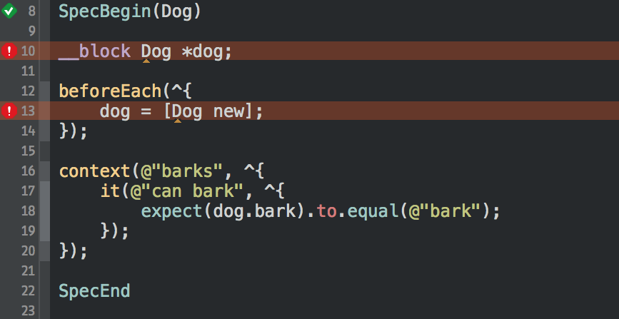
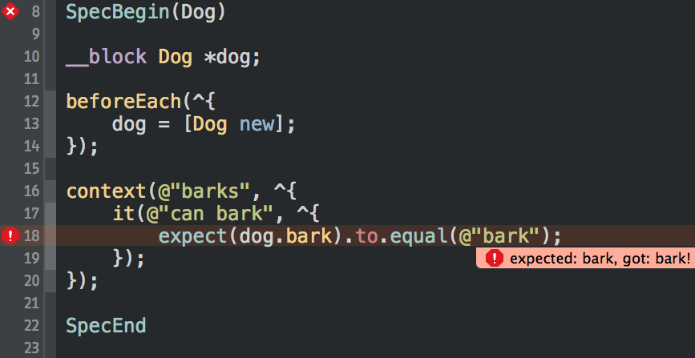
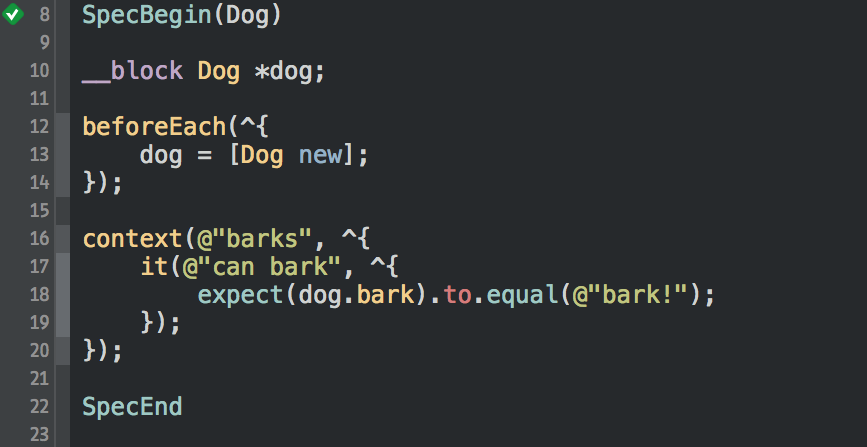
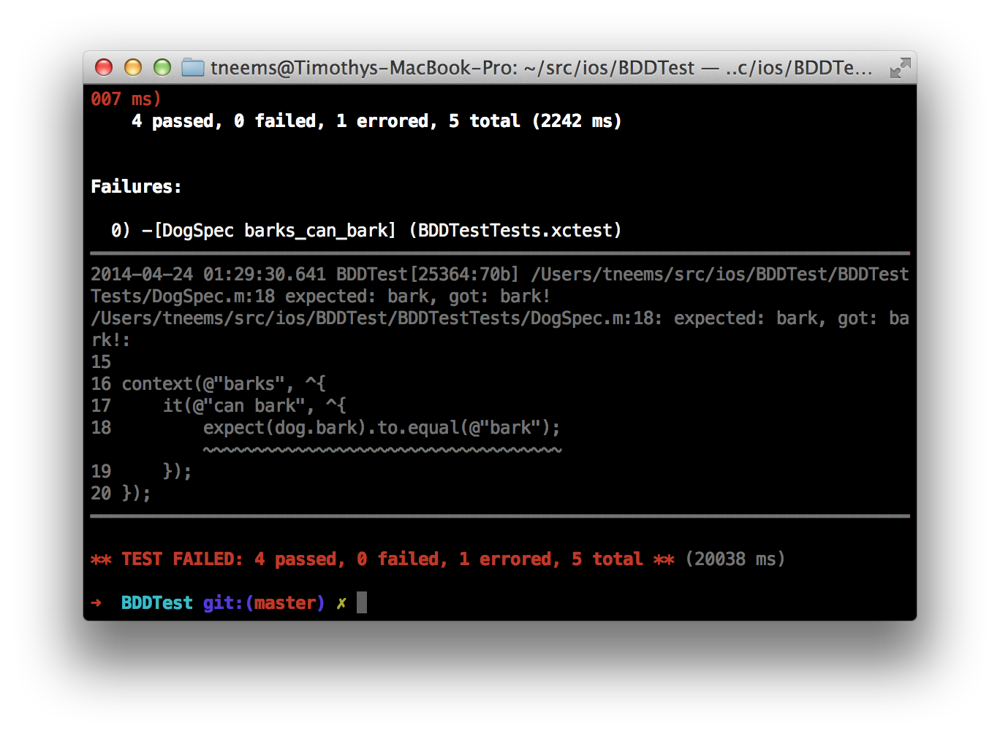
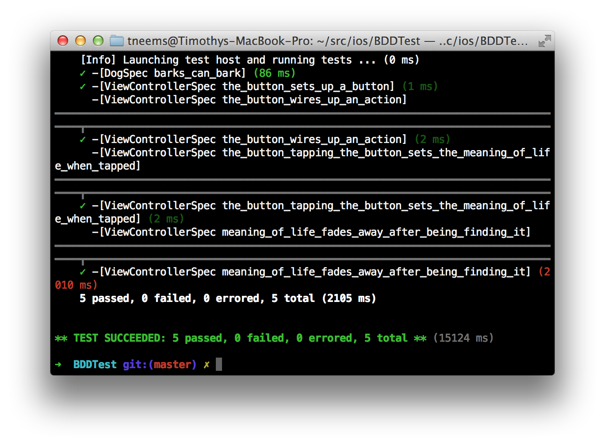

# iOS BDD with Specta and Expecta

---

# Specta
## A light-weight TDD / BDD framework for Objective-C & Cocoa

---

# Expecta
## A Matcher Framework for Objective-C/Cocoa

---
# Getting Sarted

```ruby
target 'BDDTests' do
  pod 'Specta'
  pod 'Expecta'
end
```
---

```objectivec
SpecBegin(Dog)

__block Dog *dog;

beforeEach(^{
    dog = [Dog new];
});

context(@"barks", ^{
    it(@"can bark", ^{
        expect(dog.bark).to.equal(@"bark");
    });
});

SpecEnd
```

---

# [fit] ⌘+U

---



---



---



---

# [fit]Testing View Controllers

---

```objectivec
SpecBegin(ViewController)

__block ViewController *vc;
beforeEach(^{
    UIStoryboard *mainStoryboard = [UIStoryboard storyboardWithName:@"Storyboard"
                                                             bundle:nil];
    vc = [mainStoryboard instantiateInitialViewController];

    expect(vc.view).toNot.beNil();
});

SpecEnd
```

---

```objectivec
SpecBegin(ViewController)
__block ViewController *vc;
beforeEach(^{...});

context(@"the button", ^{
    it(@"sets up a button", ^{
        expect(vc.coolButton).to.beInstanceOf([UIButton class]);
    });

    it(@"wires up an action", ^{
        NSArray *actions = [vc.coolButton actionsForTarget:vc
                                           forControlEvent:UIControlEventTouchUpInside];
        expect(actions.firstObject).to.equal(@"buttonTapped:");
    });
});

SpecEnd
```

---

```objectivec
SpecBegin(ViewController)
__block ViewController *vc;
beforeEach(^{...});

context(@"the button", ^{
    context(@"tapping the button", ^{
        beforeEach(^{
            expect(vc.meaningOfLife.text).to.beEmpty();
            [vc.coolButton sendActionsForControlEvents:UIControlEventTouchUpInside];
        });

        it(@"sets the meaning of life when tapped", ^{
            expect(vc.meaningOfLife.text).to.equal(@"42");
        });
    });
});

SpecEnd
```

---

```objectivec
SpecBegin(ViewController)
__block ViewController *vc;
beforeEach(^{...});

context(@"meaning of life", ^{
    it(@"fades away after being finding it", ^AsyncBlock{
        vc.meaningOfLife.text = @"42";
        dispatch_after(dispatch_time(DISPATCH_TIME_NOW, 2 * NSEC_PER_SEC),
                       dispatch_get_global_queue(DISPATCH_QUEUE_PRIORITY_HIGH, 0), ^{
            expect(vc.meaningOfLife.text).to.beEmpty();
            done();
        });
    });
});

SpecEnd
```

---

# BONUS

## xctool is your frield

```
xctool -workspace BDDTest.xcworkspace \
       -scheme BDDTest -destination=build \
       -configuration Debug \
       -sdk iphonesimulator7.1 \
       ONLY_ACTIVE_ARCH=YES clean build test
```

---


---


---
# Code + Presentation

https://github.com/tneems/BDDTest
